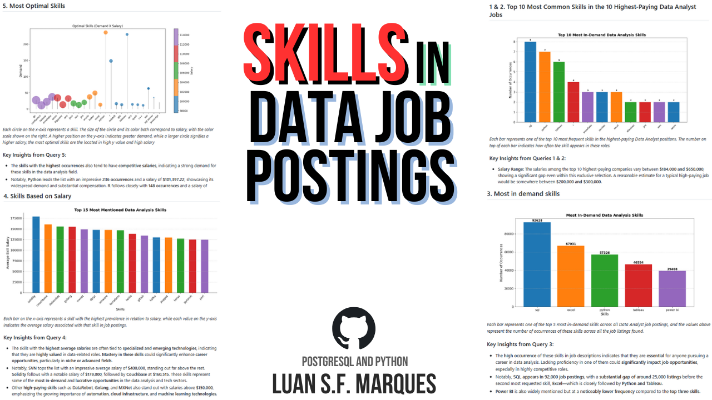
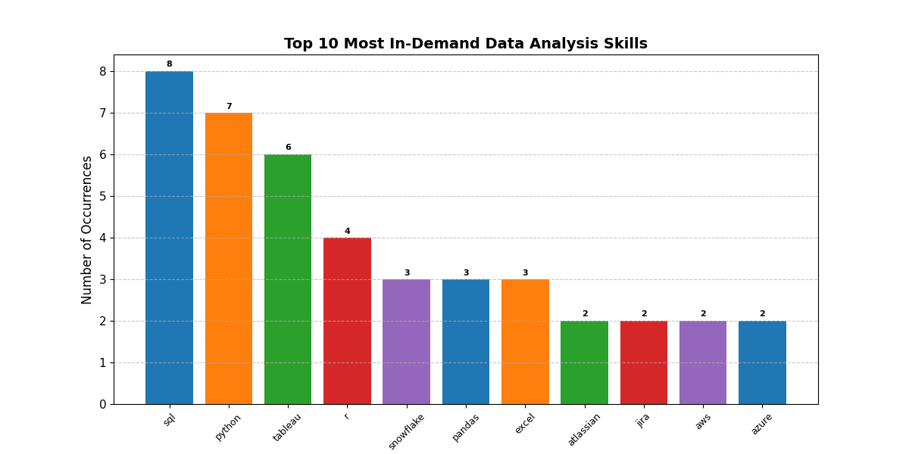
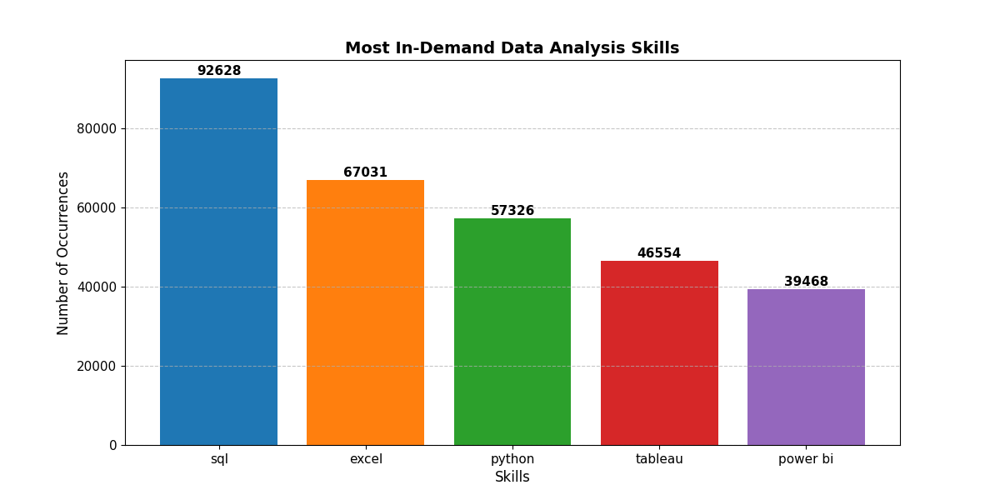
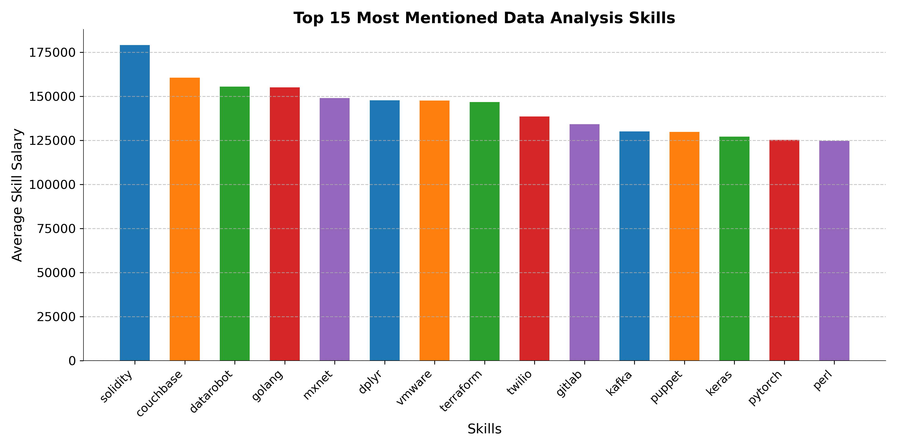
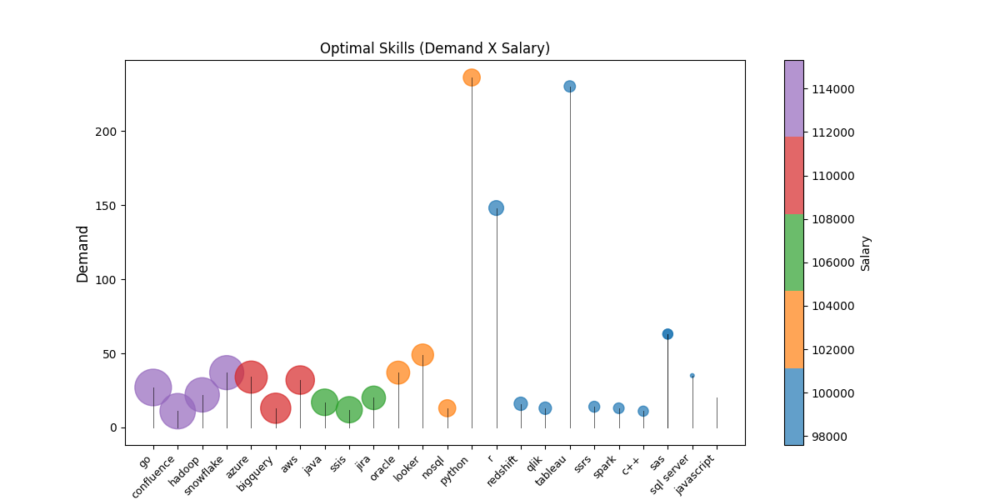

# Introduction
Dive into valuable insights that uncover trends between skills and job opportunities in data analysis roles! 
This analysis highlights the average salary per skill in DA positions, identifies the most in-demand skills, and explores the "optimal" skill set for success in the field.

All queries and the Python visualization script are featured on the main page of the repository.

Additionally, you can explore the results of all 5 queries in CSV format here:
[CSV output](/By_type/Data_Analysis/sql_data_jobs_analysis/data_output/)

# Background
This project was created as a final assignment for the SQL course taught by the amazing Luke Baroussse. You can check out the course here:  
[Video](https://www.youtube.com/watch?v=7mz73uXD9DA)

The course presented a series of challenges, and the main dataset (stored in PostgreSQL) was provided by the instructor. My task was to load this dataset locally and analyze the data using SQL queries, with a focus on identifying key trends relevant to my area of interest: **data analysis**.

The dataset, although from 2023, still offers highly relevant insights for today's job market. In addition to the SQL queries, I took the initiative to enhance the project by creating data visualizations using **Matplotlib** in **Python**—something not part of the original course curriculum but added to improve the overall presentation and deepen my understanding of data visualization.

### The five main questions provided by the course were:
- What are the highest-paying jobs for my role?
- What skills are required for these top-paying roles?
- What are the most in-demand skills for my role?
- What are the top skills based on salary for my role?
- What are the most optimal skills to learn? (Optimal: High Demand AND High Paying)

# Tools I Used
For this analysis, I leveraged key skills essential to the data analysis process:

**PostgreSQL**: Used for storing and delivering data.

**SQL**: Applied in a traditional manner to perform queries and extract insights.

**Python**: The primary tool for handling query results (using Pandas) and creating visualizations (using Matplotlib).

**GitHub**: Used for version control and project publication.

**ChatGPT**: Used to assist with problem-solving and code development.

# The Analysis

Each of the five key questions in this analysis was explored using queries to investigate trends and patterns in the Data Analyst job market.

## 1 & 2. Top 10 Most Common Skills in the 10 Highest-Paying Data Analyst Jobs

*Each bar represents one of the top 10 most frequent skills in the highest-paying Data Analyst positions. The number on top of each bar indicates how often the skill appears in these roles.*

### Key Insights from Queries 1 & 2:
- **Salary Range:** The salaries among the top 10 highest-paying companies vary between **$184,000 and $650,000**, showing a significant gap even within this exclusive selection. A reasonable estimate for a typical high-paying job would be somewhere between **$200,000 and $300,000**.  

- **Most Commonly Required Skills:**  
  - **60% of the top-paying positions require three of the most widely recognized data skills:**  
    - SQL (**80%**)  
    - Python (**70%**)  
    - Tableau (**60%**)  
  - **Around 50% of these jobs also list other well-known skills** like Excel, R, and Pandas.  

- **Less Common but High-Value Skills:**  
  - Skills like Azure, Jira, AWS, Atlassian, and others appear in lower percentages.  
  - These specialized skills **vary significantly between job postings**, but every high-paying job **requires at least one highly uncommon skill**, setting them apart from general openings.  

## 3. Most in demand skills

*Each bar represents one of the top 5 most in-demand skills across all Data Analyst job postings, and the values above represent the number of occurrences of these skills across all the job listings found.*

### **Key Insights from Query 3**:
- The **high occurrence** of these skills in job descriptions indicates that they are **essential** for anyone pursuing a career in data analysis. Lacking proficiency in one of them could **significantly impact job opportunities**, especially in highly competitive roles.  
- Notably, **SQL appears in 92,000 job postings**, with a **substantial gap of around 25,000 listings** before the second most requested skill, **Excel**—which is closely followed by **Python and Tableau**.  
- **Power BI** is also widely mentioned but at a **noticeably lower frequency** compared to the **top three skills**.  

## 4. Skills Based on Salary

*Each bar on the x-axis represents a skill with the highest prevalence in relation to salary, while each value on the y-axis indicates the average salary associated with that skill in job postings.*

### **Key Insights from Query 4**:
- The skills with the **highest average salaries** are often tied to **specialized and emerging technologies**, indicating that they are **highly valued** in data-related roles. **Mastery in these skills** could significantly enhance **career opportunities**, particularly in **niche or advanced fields**.
- Notably, **SVN** tops the list with an impressive average salary of **$400,000**, standing out far above the rest. **Solidity** follows with a notable salary of **$179,000**, followed by **Couchbase** at **$160,515**. These skills represent some of the **most in-demand** and **lucrative opportunities** in the data analysis and tech sectors.
- Other **high-paying skills** such as **DataRobot**, **Golang**, and **MXNet** also stand out with salaries above **$150,000**, emphasizing the growing importance of **automation**, **cloud infrastructure**, and **machine learning technologies**.

## 5. Most Optimal Skills

*Each circle on the x-axis represents a skill. The size of the circle and its color both correspond to salary, with the color scale shown on the right. A higher position on the y-axis indicates greater demand, while a larger circle signifies a higher salary, the most optimal skills are the located in high y value and high salary*

### **Key Insights from Query 5**:
- The **skills with the highest occurrences** also tend to have **competitive salaries**, indicating a strong demand for these skills in the data analysis field.
- Notably, **Python** leads the list with an impressive **236 occurrences** and a salary of **$101,397.22**, showcasing its widespread demand and substantial compensation. **R** follows closely with **148 occurrences** and a salary of **$100,498.77**, emphasizing its importance in data analysis roles.
- Other highly requested skills include **Go** with **27 occurrences** and a salary of **$115,319.89**, as well as **Java** with **17 occurrences** and a salary of **$106,906.44**, both reflecting strong demand for programming expertise.
- **Cloud-based technologies** like **Azure**, **AWS**, and **Snowflake** also show high occurrences and attractive salaries. **Snowflake** leads with **37 occurrences** and a salary of **$112,947.97**, followed by **Azure** at **$111,225.10** and **AWS** at **$108,317.30**, suggesting a growing trend in cloud computing roles.
- In contrast, while skills like **SQL Server**, **Tableau**, and **JavaScript** are in demand, they have slightly lower salaries compared to the top-paying skills, which could indicate that they are more common in the job market, hence a broader supply.

# What i Learned
Through this project, I ventured into various types of analyses that are part of real-world market scenarios, while also enhancing my technical skills with common tools used in data analysis. Here’s a summary of what I’ve learned:

- Strengthened essential skills like SQL and Python.
- Gained experience working with large databases and valuable real-world data.
- Created visualizations that make insights more accessible and understandable to others.
# Conclusions
This project has provided valuable insights into the skills required for high-paying and in-demand Data Analyst roles. By analyzing various datasets, we identified the most essential and optimal skills needed to excel in this field, along with the salary trends associated with these competencies. 

Key takeaways include:
- **Technical expertise** in specialized areas like **Python**, **R**, **Go**, and **Solidity** is crucial for those aiming for high-paying roles.
- **Cloud technologies** such as **Azure**, **AWS**, and **Snowflake** are becoming increasingly important, with demand and salaries on the rise.
- A solid foundation in **SQL** and **Tableau** continues to be in high demand across the board, but they may offer slightly lower salaries compared to niche skills.
- **Mastery of emerging technologies** like **SVN**, **DataRobot**, and **MXNet** can significantly boost career opportunities in the evolving landscape of data analysis and machine learning.

Overall, this analysis emphasizes the importance of both **specialization** and **diversified skills** for a successful career in data analysis, making it clear that continuous learning and adapting to new technologies is key to staying competitive in this field.

